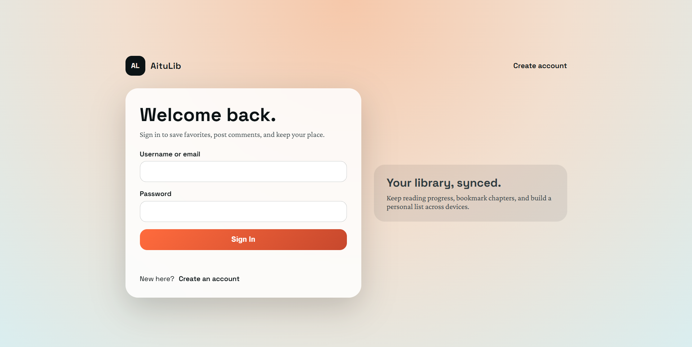
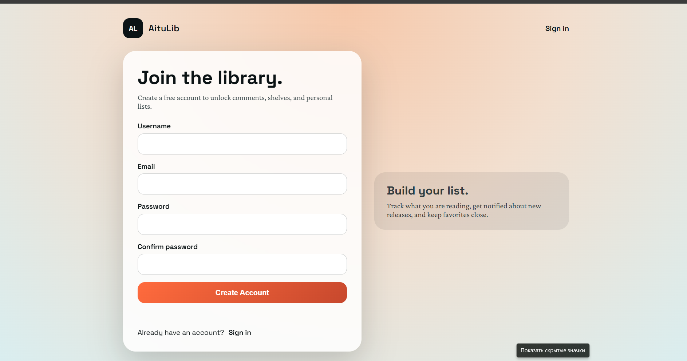
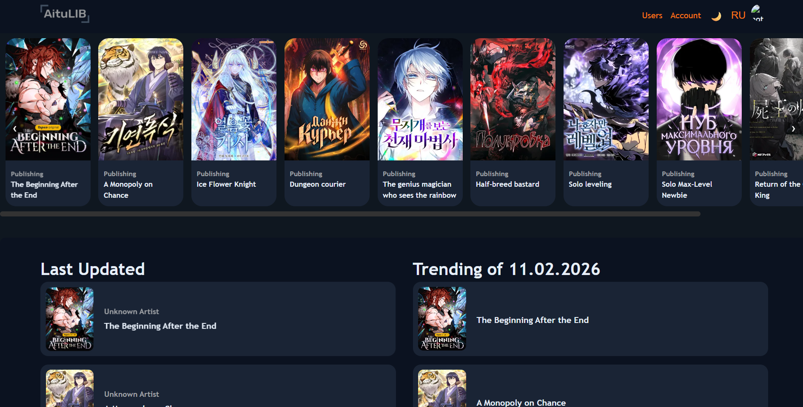
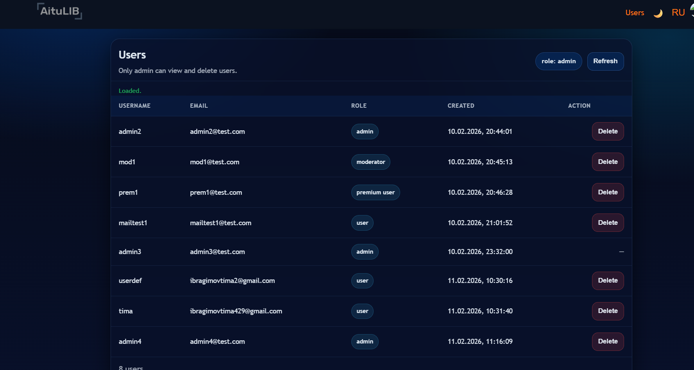
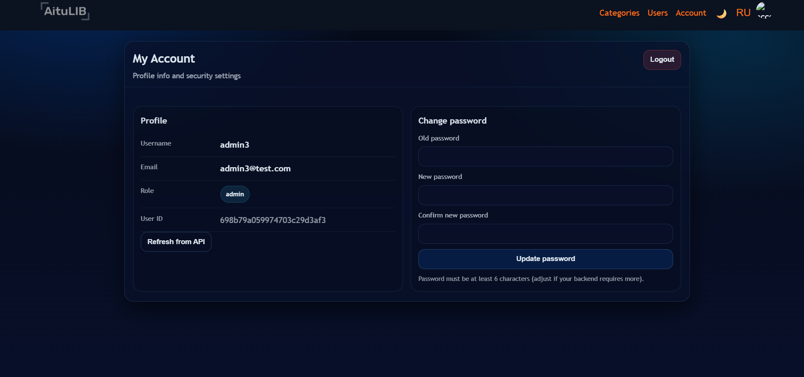
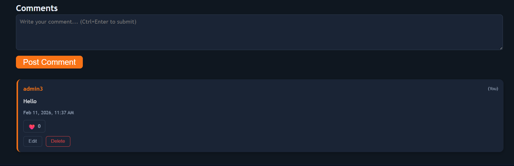

# AituLIB (LibManga) — Node.js + Express + MongoDB Atlas

Full-stack web app for browsing manga, reading chapters, and interacting via comments. Includes authentication with roles (RBAC), admin user management, and an account page with password change + logout.

---

## Features

### Authentication & Roles
- Sign up (new user saved to MongoDB Atlas, default role: `user`)
- Sign in (JWT issued; role is taken from DB)
- Roles supported: `user`, `premium user`, `moderator`, `admin`

### Manga
- Browse manga list (carousel/top + last updated + trending)
- Manga details page (by `id`)
- Moderator can create/update manga
- Admin can delete manga

### Chapters
- View chapters (by manga)
- Moderator can create/update chapters
- Admin can delete chapters

### Comments
- Add comment (authorized users)
- Edit/delete own comments
- Like comments

### Admin panel
- Users list page (admin only)
- Admin can delete users directly on the page

### Account page
- Show user info (username, email, role, user id)
- Change password
- Logout

---

## Tech Stack
- Backend: Node.js, Express
- DB: MongoDB Atlas (Mongoose)
- Auth: JWT (`jsonwebtoken`), password hashing (`bcryptjs`)
- Email (optional): `nodemailer`
- Frontend: HTML/CSS/JS (plus jQuery in some pages)

---

## Project Structure

```

aitulib-backend/
server.js
config/
controllers/
middlewares/
models/
routes/
services/
public/
style/
scripts/
assets/
views/
index.html
users.html
account.html
signin.html
signup.html
...

````

> Note: HTML pages are stored in `views/`. The server is configured to serve `views/*.html` routes like `/users.html`, `/account.html`, etc.

---

## Setup Instructions

### 1) Install dependencies
```bash
cd aitulib-backend
npm install
````

### 2) Create `.env`

Create file: `aitulib-backend/.env`

```env
MONGO_URI=mongodb+srv://<user>:<pass>@<cluster>/<db>?retryWrites=true&w=majority
PORT=3000
JWT_SECRET=your_super_secret

# Optional email (SMTP)
SMTP_HOST=smtp.example.com
SMTP_PORT=587
SMTP_USER=your_email@example.com
SMTP_PASS=your_password
SMTP_FROM=your_email@example.com

# Optional: allow selecting role at signup (recommended OFF in production)
ALLOW_ROLE_ON_SIGNUP=false
```

### 3) Run the server

```bash
node server.js
```

Open in browser:

* `http://localhost:3000/` (home)
* `http://localhost:3000/signin`
* `http://localhost:3000/signup`
* `http://localhost:3000/users.html` (admin only)
* `http://localhost:3000/account.html` (logged-in users)

---

## Admin Setup (How to get an Admin account)

By default, all new signups get role `user`.
To create an admin for testing/demo:

### Option A (quick)

1. Set in `.env`:

```env
ALLOW_ROLE_ON_SIGNUP=true
```

2. Sign up sending role:

```json
{
  "username": "admin",
  "email": "admin@test.com",
  "password": "Admin123!",
  "role": "admin"
}
```

3. Set back:

```env
ALLOW_ROLE_ON_SIGNUP=false
```

### Option B (MongoDB Atlas)

* Create a normal user, then update its document:

```json
{ "role": "admin" }
```

---

## API Documentation

Base URL:

* Local: `http://localhost:3000`

### Authorization

Protected routes require header:

```
Authorization: Bearer <accessToken>
```

---

### Auth

#### Sign up

`POST /api/auth/signup`

Body:

```json
{ "username": "user1", "email": "user1@test.com", "password": "123456" }
```

Response:

```json
{ "id": "...", "username": "...", "email": "...", "role": "user", "accessToken": "..." }
```

#### Sign in

`POST /api/auth/signin`

Body:

```json
{ "email": "user1@test.com", "password": "123456" }
```

or

```json
{ "username": "user1", "password": "123456" }
```

---

### Users

#### Get all users (admin only)

`GET /api/users`

#### Get user by id (requires auth; access depends on your RBAC rules)

`GET /api/users/:id`

#### Delete user (admin only)

`DELETE /api/users/:id`

#### Change password (authorized user)

`PUT /api/users/:id/change-password`

Body:

```json
{ "oldPassword": "old123", "newPassword": "new12345" }
```

---

### Manga

#### Get all manga

`GET /api/manga`

#### Get manga by id

`GET /api/manga/:id`

#### Create manga (moderator)

`POST /api/manga`

#### Update manga (moderator)

`PUT /api/manga/:id`

#### Delete manga (admin)

`DELETE /api/manga/:id`

---

### Chapters

#### Get chapters

`GET /api/chapters`

#### Get chapter by id

`GET /api/chapters/:id`

#### Create chapter (moderator)

`POST /api/chapters`

#### Update chapter (moderator)

`PUT /api/chapters/:id`

#### Delete chapter (admin)

`DELETE /api/chapters/:id`

---

### Comments

#### Get comments

`GET /api/comments`

#### Create comment (auth)

`POST /api/comments`

#### Edit comment (owner/auth)

`PATCH /api/comments/:id`

#### Like comment

`PATCH /api/comments/:id/like`

#### Delete comment (owner/auth)

`DELETE /api/comments/:id`

---

## Screenshots (All Web App Features)


### 1) Authentication (Sign In / Sign Up)




### 2) Home Page (Manga carousel + sections)



### 3) Users Page (Admin only: list + delete)



### 4) Account Page (Profile + Change password)



### 5) Comments (Create/Edit/Delete/Like)



---

## Notes for Testing (Postman)

1. Sign in to get `accessToken`
2. Use header `Authorization: Bearer <token>` for protected endpoints
3. Admin endpoints:

  * `GET /api/users`
  * `DELETE /api/users/:id`

---
